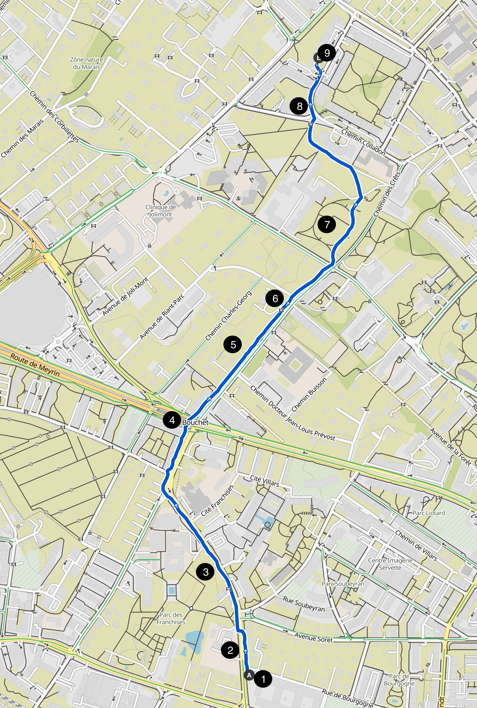
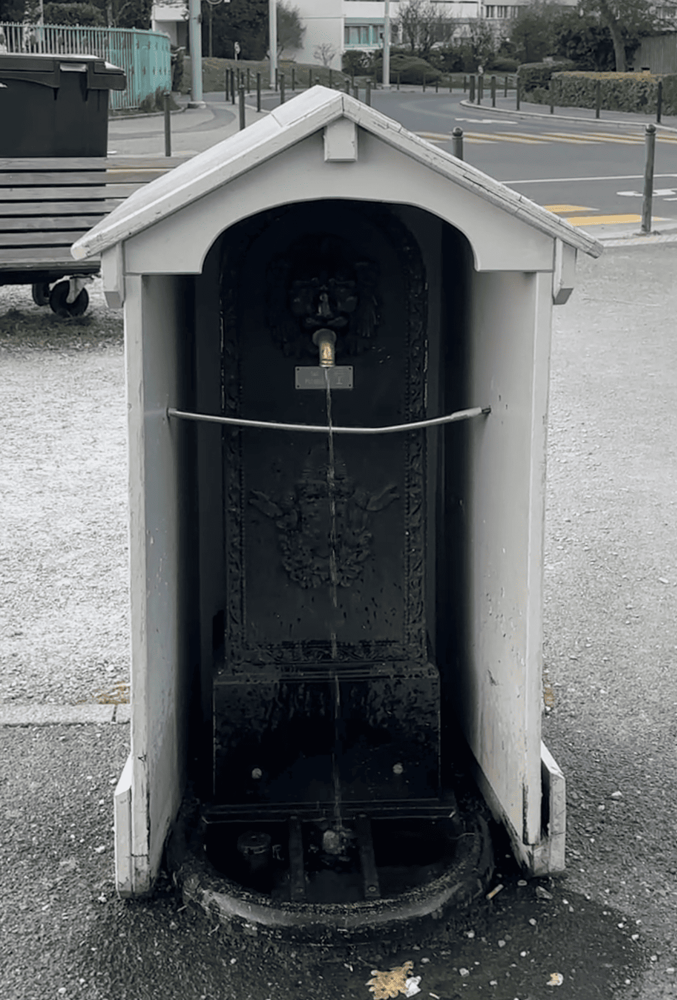
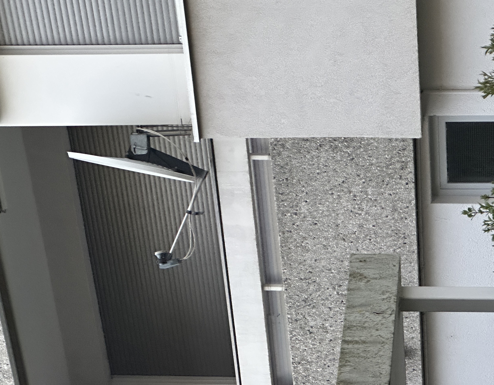
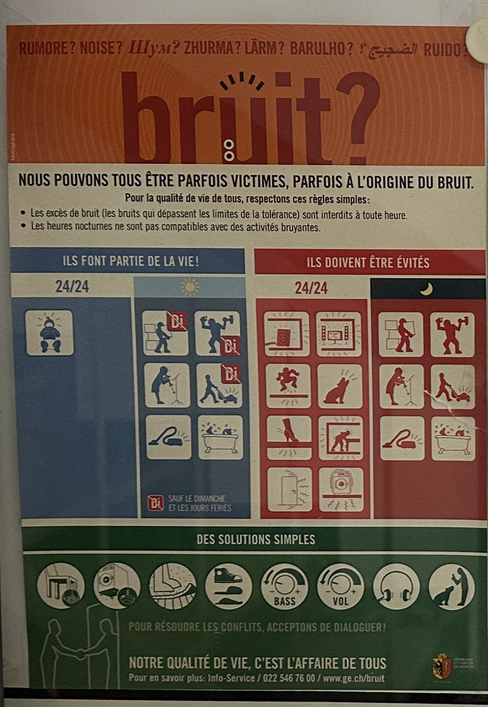

# Arpentages Observation

## 1. Route Info

- **Starting Point**: Refettorio restaurant
- **Ending Point**: Home
- **Total Duration**: 1 hour + 33 minutes
- **Route Sketch or Description**:
  - 

---

## 2. Observation Points

### 📍 Point 1: Refettorio restaurant

- **Visual Elements**:
  - People sitting in the restaurant talking with each other, even with new people
  - Servers serving food, smiling and asking people for their order
  - Cooks in the kitchen, preparing food,
  - Foods are being served in the restaurant
- **Auditory Elements**:
  - People's voices, laughter, and conversations
  - Music from the restaurant
- **Olfactory Elements**:
  - Baked duck
  - Coffee
  - Detox tea
- **Atmosphere & Feeling**:
  - Welcoming and warm
  - Lively and cheerful
- **Flow of People**:
  - People coming in and out of the restaurant
  - Servers moving around the restaurant to serve food

|  |  |  |
| ------------------------------- | ------------------------------- | ------------------------------- |

---

### 📍 Point 2: Road construction

- **Visual Elements**:
  - Warning signs
  - Construction materials
  - Pedestrians and cars passing by
- **Auditory Elements**:
  - Car horns & engines
- **Olfactory Elements**:
  - Smoke from cars
- **Atmosphere & Feeling**:
  - Noisy
  - Busy
- **Flow of People**:
  - People walking on the pedestrian road
  - People riding bikes passing the road

|  |  |  |
| ------------------------------- | ------------------------------- | ------------------------------- |

---

### 📍 Point 3: High school

- **Visual Elements**:
  - Ambulance
- **Auditory Elements**:
  - Ambulance siren
- **Atmosphere & Feeling**:
  - Noisy & tense
- **Flow of People**:
  - People running to the ambulance
  - People standing around the ambulance

|  |  |
| ------------------------------- | ------------------------------- |

---

### 📍 Point 4: Bouchet intersection

- **Visual Elements**:
  - Trams & cars
  - Pedestrians
  - Signals
  - Stores & restaurants (pizza etc)
- **Auditory Elements**:
  - Trams
  - Cars & bikes
  - Wind
  - Birds
- **Olfactory Elements**:
  - Pizza
- **Atmosphere & Feeling**:
  - Noisy
  - Windy & chilly
- **Flow of People**:
  - People crossing the road to take the tram
  - People waiting for the tram

|  |  |  |
| ------------------------------- | ------------------------------- | ------------------------------- |

|  |  |  |
| ------------------------------- | ------------------------------- | ------------------------------- |

---

### 📍 Point 5: Houses

- **Visual Elements**:
  - Houses
  - Trees
  - Fence
  - Cars
  - Mailbox
  - Electricity storage?
  - Paper trash bin
- **Auditory Elements**:
  - Birds chirping
  - Wind
  - Cars
- **Atmosphere & Feeling**:
  - Quiet
  - Calm
- **Flow of People**:
  - People walking
  - People riding bikes

|  |  |  |
| ------------------------------- | ------------------------------- | ------------------------------- |

|  |  |
| ------------------------------- | ------------------------------- |

---

### 📍 Point 6: Qatar embassy

- **Visual Elements**:
  - High fence
  - cctv cameras
  - Qatar flag
- **Auditory Elements**:
  - Wind
- **Atmosphere & Feeling**:
  - Quiet
- **Flow of People**:
  - People walking

|  |  |
| ------------------------------- | ------------------------------- |

---

### 📍 Point 7: Parc André-Chavanne

- **Visual Elements**:
  - Trees
  - Birds
  - Grass
- **Auditory Elements**:
  - Wind
  - Ball bouncing
  - People talking
- **Olfactory Elements**:
  - Grass
  - Flowers
- **Atmosphere & Feeling**:
  - Quiet
  - Calm
  - Peaceful
- **Flow of People**:
  - People playing with balls
  - People walking their dogs

|  |  |  |
| ------------------------------- | ------------------------------- | ------------------------------- |

---

### 📍 Point 8: Chem. du Champ-d'Anier

- **Visual Elements**:
  - cctv cameras
  - Apartment buildings
  - Post box
  - Fire hydrant
  - Pedestrian sign (elderly people)
  - Small farm fields
- **Auditory Elements**:
  - Wind
  - Cars
  - Water flowing
- **Atmosphere & Feeling**:
  - Quiet
  - Calm
- **Flow of People**:
  - People walking
  - People riding bikes
  - People getting out of the tram

|  |  |
| ------------------------------- | ------------------------------- |

|  |  |
| ------------------------------- | ------------------------------- |

---

### 📍 Point 9: appartment building

- **Visual Elements**:
  - Cars
  - Apartment building
  - Mailbox
  - Antennas
  - Trees
- **Auditory Elements**:
  - Wind
  - Cars
  - Birds chirping
- **Atmosphere & Feeling**:
  - Quiet & calm

|  |  |
| ------------------------------- | ------------------------------- |

---

## 3. Final Reflection

### **Recurring Patterns**

- **Wind and bird sounds** were consistent in the quieter areas, often paired with greenery and residential surroundings.
- I noticed that **People in motion** (walking, biking, commuting) were shown throughout the journey, but their **pace and purpose** changed > fast and busy near roads, slow and relaxed near parks and housing.

---

### **New Questions**

- How do urban transitions from noise to quiet, public to private affect our **mood or mental state** during walking?
- What kind of **invisible systems** are underlying these places?
  - (e.g., security infrastructure near embassies, transportation data at intersections, networks in residential areas)
- Could a walking route like this be mapped in **energy flow terms** instead of physical structure?
  - What’s the "emotional" topography?

---

### **Next Places or Themes to Explore**

- A **single area at multiple times of day** — e.g., observing the same park in the morning, afternoon, and late evening.
- A walk focused on **invisible infrastructures** (CCTV, antennas, sensors, power lines).
- Diffrerent places such as shopping center, train station, etc.
